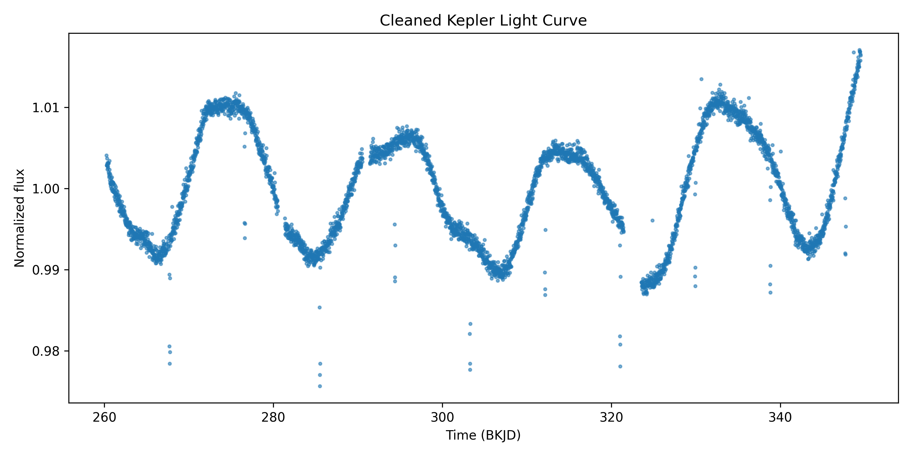
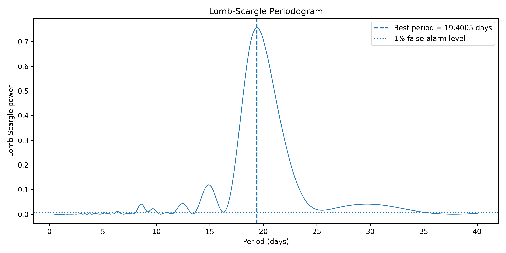
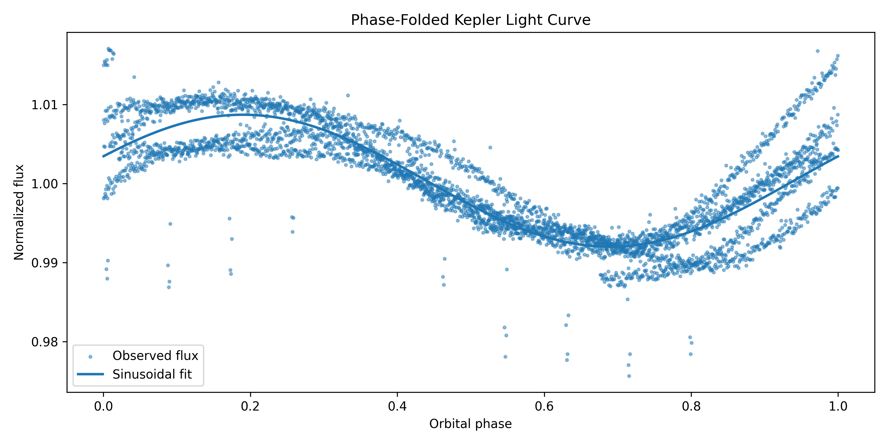
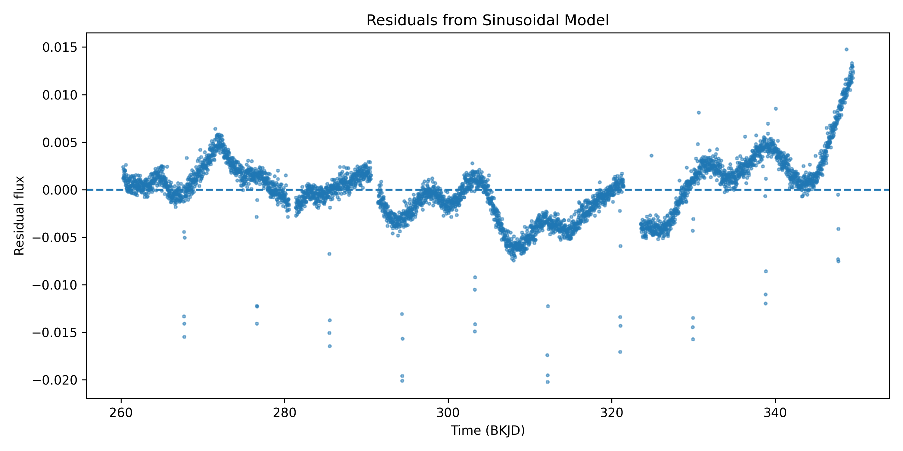

# Kepler Light Curve Period Analysis

This project analyzes a Kepler light curve from a FITS file using Python and Astropy. It extracts corrected flux, removes flagged or invalid points, normalizes the light curve, estimates the dominant period with a Lomb-Scargle periodogram, fits a sinusoidal model, and saves diagnostic outputs.

## Project Goal

The goal is to perform a reproducible period analysis on real Kepler light-curve data. The project uses FITS data rather than a synthetic signal and reports period estimates, uncertainty metrics, residual behavior, and removed data points.

## Methods

The analysis includes:

- loading Kepler FITS light-curve data with Astropy
- using PDCSAP_FLUX when available
- filtering invalid, nonpositive, and quality-flagged points
- normalizing flux by the median cleaned flux
- estimating the dominant period with Lomb-Scargle analysis
- estimating period uncertainty from the periodogram peak width
- fitting a sinusoidal model near the recovered period
- generating a phase-folded light curve
- plotting residuals from the fitted model
- saving cleaned data, removed points, and period summary metrics

## Repository Structure

    kepler-lightcurve-analysis/
    ├── src/
    │   └── main.py
    ├── data/
    │   └── [Kepler FITS file]
    ├── outputs/
    │   ├── cleaned_light_curve.csv
    │   ├── flagged_removed_points.csv
    │   ├── period_analysis_summary.csv
    │   ├── cleaned_light_curve.png
    │   ├── lomb_scargle_periodogram.png
    │   ├── model_fit.png
    │   ├── phase_folded_light_curve.png
    │   └── residuals.png
    ├── docs/
    │   └── method.md
    └── README.md

## Example Outputs

The cleaned light curve shows normalized Kepler flux after invalid and quality-flagged points are removed.

The Lomb-Scargle periodogram identifies the strongest periodic signal in the light curve.

The phase-folded light curve checks whether the recovered period aligns repeated flux variation.

The residual plot shows the difference between the observed normalized flux and the fitted sinusoidal model.

## Output Tables

The script saves:

    outputs/cleaned_light_curve.csv
    outputs/flagged_removed_points.csv
    outputs/period_analysis_summary.csv

The summary file includes:

- source FITS file
- flux column used
- raw point count
- cleaned point count
- removed point count
- Lomb-Scargle period estimate
- period uncertainty estimate
- sinusoidal fitted period
- residual RMS and standard deviation

## Scientific Context

Kepler light curves measure stellar brightness over time. Periodic brightness changes can come from stellar rotation, pulsation, eclipsing binaries, or transiting planets. This project does not claim a planet detection. It demonstrates time-series period recovery and diagnostic analysis using real Kepler FITS data.

## Skills Demonstrated

- Python scientific computing
- FITS data handling with Astropy
- Kepler light-curve cleaning
- Lomb-Scargle period analysis
- phase folding
- residual analysis
- reproducible CSV output generation

## Run

Install dependencies:

    python3 -m pip install numpy pandas matplotlib astropy scipy

Run the analysis:

    python3 src/main.py
