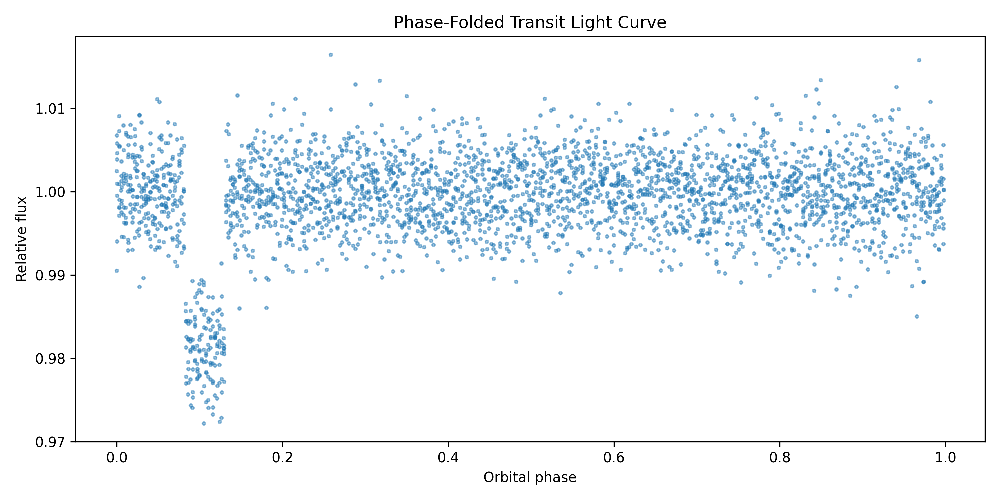

# Stellar Time-Series Analysis

Period searches on stellar light curves, run as two experiments against one shared search module. The first measures a variability period in a real Kepler light curve. The second validates the search methods on a synthetic light curve with a known injected transit, so recovery accuracy can be checked against ground truth.

The two runs also demonstrate why method choice matters. Lomb-Scargle finds the Kepler star's smooth 19.4 day variability cleanly, but on the box-shaped transit signal it locks onto a 1.24 day alias while Box Least Squares recovers the injected 3.72 day period to within 1.4 minutes.

## Kepler analysis

`src/kepler_analysis.py` reads a Kepler FITS light curve (PDCSAP_FLUX preferred, SAP_FLUX fallback), removes NaN, nonpositive, and quality-flagged points, normalizes by the median flux, and searches 0.5 to 40 days with a Lomb-Scargle periodogram at 25,000 frequency samples. A bounded sine fit refines the periodogram period, and the light curve is folded on the fitted value.


Results on the included light curve (KIC 757450, Q3 long cadence, 4134 of 4370 points kept):

| Quantity | Value |
|---|---|
| Lomb-Scargle period | 19.4005 days |
| Peak-width uncertainty | 1.90 days |
| Sine-fit period | 19.4013 days |
| Formal fit uncertainty | 0.0195 days |
| Residual RMS | 0.0033 |

The peak-width uncertainty comes from the half-height width of the periodogram peak, a diagnostic rather than a posterior. Periodic brightness at this level can come from rotation, pulsation, or binarity; the pipeline measures the period without claiming a cause.

## Injection recovery

`src/injection_recovery.py` builds a 30 day synthetic light curve with an injected box transit (period 3.72 days, depth 1.8 percent, duration 0.18 days) plus a slow sinusoidal trend and Gaussian noise, then runs both search methods over 1 to 10 days.



| Quantity | Value |
|---|---|
| Injected period | 3.72 days |
| BLS recovered period | 3.72097 days |
| Absolute error | 0.00097 days (1.4 min) |
| Recovered duration | 0.175 days |
| Recovered depth | 0.0187 |
| Transit SNR | 4.36 |
| Lomb-Scargle best period | 1.2412 days (alias, expected failure) |

## Run

```bash
python3 -m pip install numpy pandas matplotlib scipy astropy
python3 src/kepler_analysis.py            # searches data/ for a FITS file
python3 src/kepler_analysis.py my.fits    # or pass one explicitly
python3 src/injection_recovery.py
```

Figures and CSV tables are written to `outputs/kepler/` and `outputs/injection/`. Each run writes a summary CSV recording every measured quantity and the search settings that produced it.

## Layout

```text
src/period_search.py         shared search methods: Lomb-Scargle, BLS, peak ranking, peak width, folding
src/kepler_analysis.py       real-data pipeline
src/injection_recovery.py    synthetic validation pipeline
data/                        Kepler FITS light curve
docs/method.md               method details for both pipelines
```

This repository absorbed the former `exoplanet-signal-detection` project; its pipeline lives on here as the injection-recovery half.
