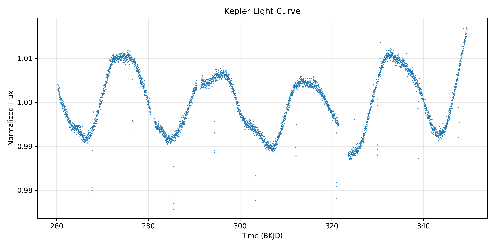
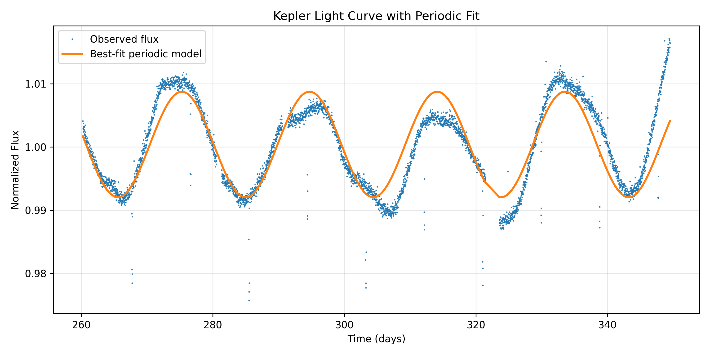
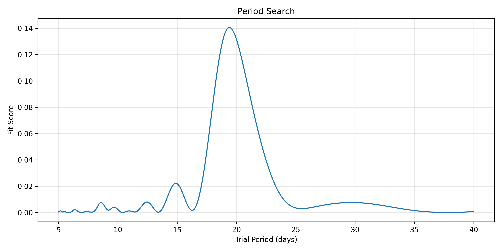

# Kepler Light Curve Analysis
Kepler light curve analysis with period estimation using Python and Astropy

This project analyzes photometric time-series data from the Kepler Space Telescope to identify periodic brightness variations in a star.

## Overview

A Kepler FITS light curve file was processed using Python and Astropy to extract time and corrected flux measurements. The data was cleaned and normalized to highlight relative brightness variations.

A sinusoidal model was applied to estimate the dominant periodic signal in the dataset.

## Results

The estimated period is approximately:

19.41 days

This periodic behavior is consistent with rotational modulation, where stellar surface features such as star spots rotate in and out of view, causing changes in observed brightness.

## Methods

- Data extraction from FITS file using Astropy
- Time-series normalization
- Period estimation using sinusoidal fitting
- Visualization of observed vs modeled light curve

## Technologies Used

- Python
- NumPy
- Matplotlib
- Astropy

## Significance

This project demonstrates how periodic signals can be extracted from noisy astronomical data, a key technique used in stellar analysis and exoplanet detection.
## Visualizations

### Raw Light Curve

### Light Curve with Best-Fit Model

### Period Search

