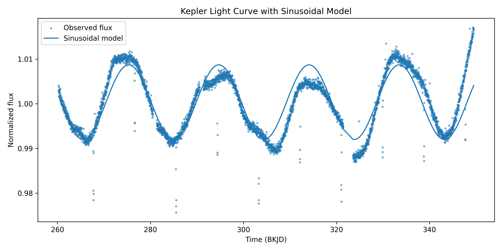

# Kepler Light Curve Analysis

This project reads a Kepler light curve from a FITS file and looks for a repeating signal in the cleaned flux data. The main goal was to work with a real Kepler file instead of a made-up time series, then check whether the strongest period still makes sense after plotting the fit, folded curve, and residuals.

The script uses Astropy to read the FITS table. It uses `PDCSAP_FLUX` when that column is available, removes invalid or quality-flagged points, normalizes the flux by the median cleaned flux, and searches for a dominant period with a Lomb-Scargle periodogram.

## What it does

The analysis pipeline:

- reads a Kepler FITS light curve
- filters NaN values, nonpositive flux values, and quality-flagged points
- normalizes the cleaned flux
- runs a Lomb-Scargle period search from 0.5 to 40 days
- estimates a rough period uncertainty from the width of the periodogram peak
- fits a sine curve near the recovered period
- phase-folds the light curve
- saves cleaned data, removed points, summary values, and plots

This is not meant to claim a planet detection. Periodic brightness changes can come from rotation, pulsation, eclipsing binaries, transits, or other variability. This repo is mainly a small time-series analysis project using real Kepler data.

## Run

Install the Python packages:

    python3 -m pip install numpy pandas matplotlib astropy scipy

Run the analysis:

    python3 src/main.py

You can also pass a specific FITS file:

    python3 src/main.py data/your_file.fits

If no file is passed, the script searches for a `.fits` or `.fit` file in `data/` first, then in the repo root.

## Outputs

The script saves cleaned data and summary files in `outputs/`:

    outputs/cleaned_light_curve.csv
    outputs/flagged_removed_points.csv
    outputs/period_analysis_summary.csv

It also saves these plots:

    outputs/cleaned_light_curve.png
    outputs/lomb_scargle_periodogram.png
    outputs/model_fit.png
    outputs/phase_folded_light_curve.png
    outputs/residuals.png

## Example result

For the included Kepler light curve, the period search recovers a signal near 19.4 days. The exact value can shift slightly depending on filtering, the period search grid, and the fitted model. The summary CSV records the Lomb-Scargle period, the fitted sine period, the period search range, the number of removed points, and residual statistics.

## Plots

Cleaned light curve:

Lomb-Scargle periodogram:

Model fit:

Phase-folded light curve:

Residuals:

## Notes

The sine fit is only a simple check against the strongest period. Real stellar variability is usually not a perfect sine wave, and Kepler light curves can include instrumental effects, gaps, and astrophysical variability. The uncertainty values in this project should be read as diagnostic estimates from this workflow, not as a full statistical treatment of the source.
